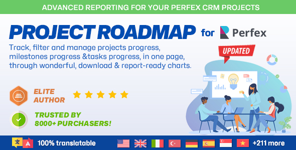

# 📊 Introduction

<figure><figcaption></figcaption></figure>

> **Advanced reporting and project management for Perfex CRM**

Thank you for choosing the Project Roadmap module! This module extends Perfex CRM with powerful project tracking, Gantt charts, Kanban boards, AI-powered suggestions, sprints, earned value management, and much more.

***

## 🚀 Quick Start

1. **Install** the module via Setup → Modules
2. **Activate** the module
3. Navigate to **Project Roadmap** in the sidebar
4. Open any project and use the view switcher (List, Gantt, Kanban, Calendar)

***

## 📑 Documentation Overview

| Section                                            | Description                                      |
| -------------------------------------------------- | ------------------------------------------------ |
| 📦 [Installation](installation.md)                 | Upload, install, and activate the module         |
| 📋 [Dashboard & Views](dashboard-views.md)         | List, Gantt, Kanban, Calendar views              |
| ✅ [Task Management](task-management.md)            | Dependencies, subtasks, progress, templates      |
| 🤖 [AI Suggestions](ai-suggestions.md)             | Smart assignee and due date suggestions          |
| 🏃 [Sprints](sprints.md)                           | Sprint planning, backlog, board, velocity charts |
| 💰 [Budget & Invoicing](budget-invoicing.md)       | EVM, retainers, invoice integration              |
| 📅 [Calendar Sync](calendar-sync.md)               | Subscribe to Google Calendar, Outlook            |
| 👥 [Client Portal](client-portal.md)               | Milestone approvals, project updates             |
| 📈 [Reporting & Analytics](reporting-analytics.md) | Export, custom reports, resource allocation      |
| 💬 [Collaboration](collaboration.md)               | Communication hub, activity feed, notifications  |
| ⚙️ [Settings](settings.md)                         | Custom fields, workflows, permissions            |
| 🆘 [Support](support.md)                           | Getting help                                     |

***

## ✨ Key Features at a Glance

| Feature                   | Description                                                    |
| ------------------------- | -------------------------------------------------------------- |
| 📊 **Gantt Charts**       | Visual timeline with task dependencies and subtasks            |
| 📌 **Kanban Board**       | Drag-and-drop task management by status                        |
| 📅 **Calendar**           | Month/week view with iCal export and subscription              |
| 🤖 **AI Suggestions**     | Workload-based assignee and due date recommendations           |
| 🏃 **Sprints**            | Agile sprint planning with backlog, board, and velocity charts |
| 💰 **EVM**                | Earned Value Management (PV, EV, AC, CPI, SPI, EAC, ETC)       |
| 📁 **Centralized Files**  | All project files in one place with version history            |
| 💬 **Communication Hub**  | Discussions, @mentions, file attachments                       |
| ⚡ **Automated Workflows** | Trigger actions on task/milestone events                       |
| 📱 **Mobile Responsive**  | Optimized for tablets and phones                               |

***

**Version:** 1.0+\
**Author:** Themesic Interactive\
**Support:** [CodeCanyon](https://codecanyon.net/item/project-roadmap-advanced-reporting-for-perfex-crm-projects/26761482)
